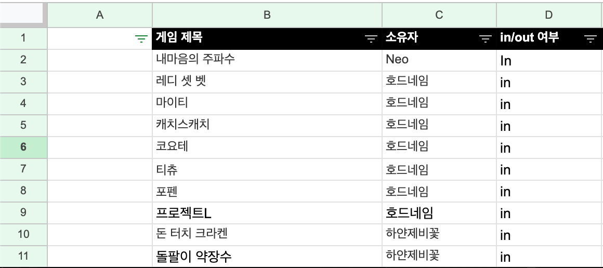
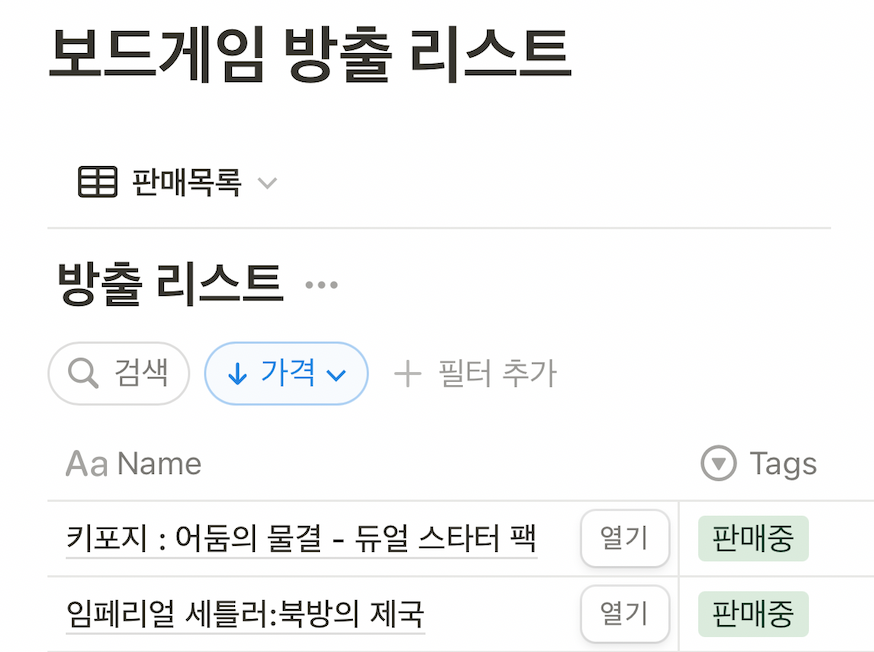

# Hoardname Web

## 프로젝트 소개
보드게임 모임 "호드네임"의 보유 보드게임 검색 및 정보 확인, 중고 거래를 위한 웹 애플리케이션입니다.

## 개발 동기 및 과정

모임의 규모가 커지면서 보유한 보드게임도 100개 이상으로 증가했고, 기존 엑셀 방식의 관리 시스템으로는 한계가 있었습니다. 보드게임의 상세 정보 확인을 위해서는 외부 사이트에서 검색해야 했으며, 회원들간의 중고 거래 시에도 카카오톡 오픈채팅방에서 반복적인 판매 홍보가 필요했습니다.

이러한 문제점들을 해결하고자 다음 세 가지 목표를 가지고 웹 애플리케이션을 개발하게 되었습니다:
1. 효율적인 보드게임 컬렉션 관리
2. 즉각적인 게임 정보 조회
3. 간편한 중고 거래 시스템 구축

  
  
   

## 핵심 기능 소개

### 1. 보드게임 검색 및 상세 정보
- BoardGameGeek API를 통한 보드게임 검색
- 최적의 플레이어, 웨이트 등의 상세 정보 제공
